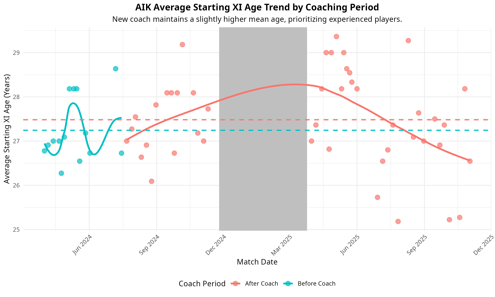
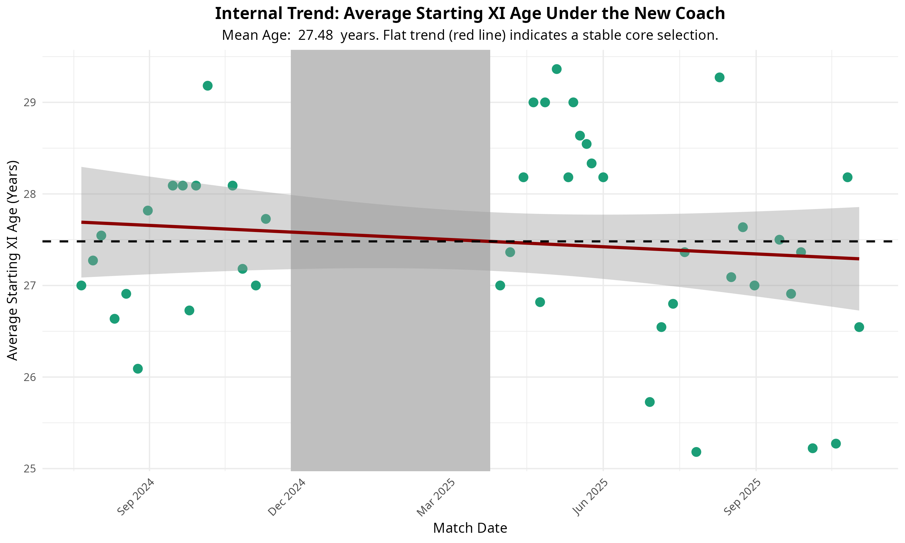
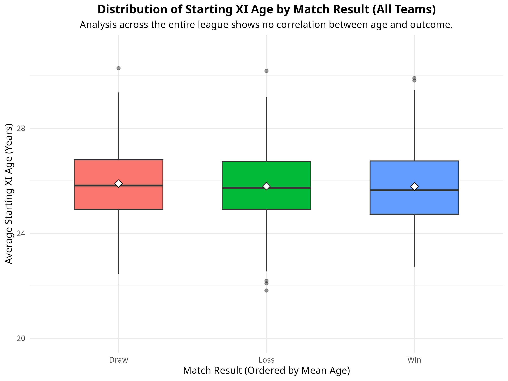

# 🧩 Final Insights and Recommendations

## 📘 Project Summary

The objective of this analysis was to determine if a correlation exists between the **average starting lineup age** and **match performance (Goals For/Against)** — specifically for the client’s team **AIK (Team ID 994)** — and to compare this trend **before and after** the arrival of the new coach (post–**July 22, 2024**).

This analysis successfully generated **two key datasets** (views in `SQL_Scripts/final_extraction.sql`) which were visualized using **R** to reveal a conflict between the coach’s **stable, experienced philosophy** and the club’s **financial model**.

---

## 📊 Top High-Level Insights (Based on Visualizations)

### 1. 🧠 AIK Coach Prefers Stability Over Youth

The new coach has maintained a starting lineup with a slightly higher mean age compared to his predecessor, indicating a philosophical reliance on an established, experienced core team.

- **Metric:** Mean Starting XI Age (New Coach: **27.48 years** vs. Former Coach: **27.24 years**)  
- **Evidence:** The trend line exhibits a near-flat internal trend (minimal negative slope), confirming that the coach has not consistently reduced the average age over his tenure.  
- **Interpretation:** The coaching philosophy prioritizes stability and experience over the integration of younger players, which may conflict with the club’s long-term financial strategy.  

📈 *Visualization:*  
  

---

### 2. ⚖️ Age Has No Competitive Advantage League-Wide

Analysis across all team-games in the **Allsvenskan league** demonstrates that an older, more expensive lineup provides **no statistical edge** in competitive performance.

- **Metric:** Mean Age vs. Match Result (Win/Loss)  
- **Result:** The mean age for winning teams (**25.78 years**) and losing teams (**25.79 years**) is statistically identical.  
- **Interpretation:** Shifting the club’s recruitment strategy toward leveraging equally competitive **younger, higher-potential players** presents a **low-risk, financially sustainable** strategy without sacrificing immediate competitive results.  

📉 *Visualization:*  

---

## 🧭 Recommendations and Next Steps (Act)

### 1. ✅ Actionable Recommendation for AIK Management

**Address Strategy Conflict:**  
Management should present the age-neutral performance data to the coaching staff. The goal is to encourage a shift in philosophy to utilize the high-potential youth pipeline without fearing a drop in competitive level, as the data proves **age is not a competitive advantage**.

**Recruitment Mandate:**  
Implement a policy to focus recruitment spending on **younger players (under 24)** for starting positions, as this is proven to be a **low-risk strategy** for maintaining match results while maximizing **future transfer revenue**.

---

### 2. 🚀 Future Deliverables and Data Expansion

To further refine the analysis and address the initial scope limitations (see `cleaning_validation.sql`, Section 6), the following steps are recommended:

- **Acquire High-Resolution Data:**  
  Seek tactical data (e.g., passing maps, press zones, distance covered per player) from specialized providers to accurately quantify the coach’s “high-pressure” or “dominant” playstyle.

- **Analyze Positional Age:**  
  Extend the age analysis beyond the average starting XI to include **average age per position group** (Defenders, Midfielders, Forwards). This would help pinpoint if specific positional age changes are driving performance gains.

- **Develop R Visualization Script:**  
  Create a final, documented R script (`visualization_script.R`) that imports the final CSVs and automatically generates key charts (e.g., goals vs. age scatter plot, goals before/after box plot) for **easy, repeatable updates**.
